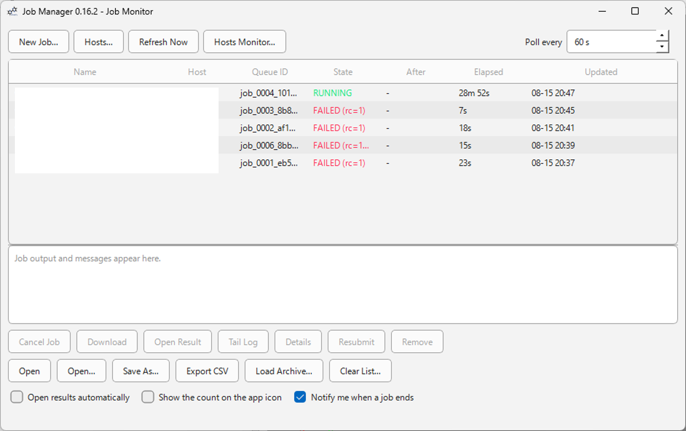
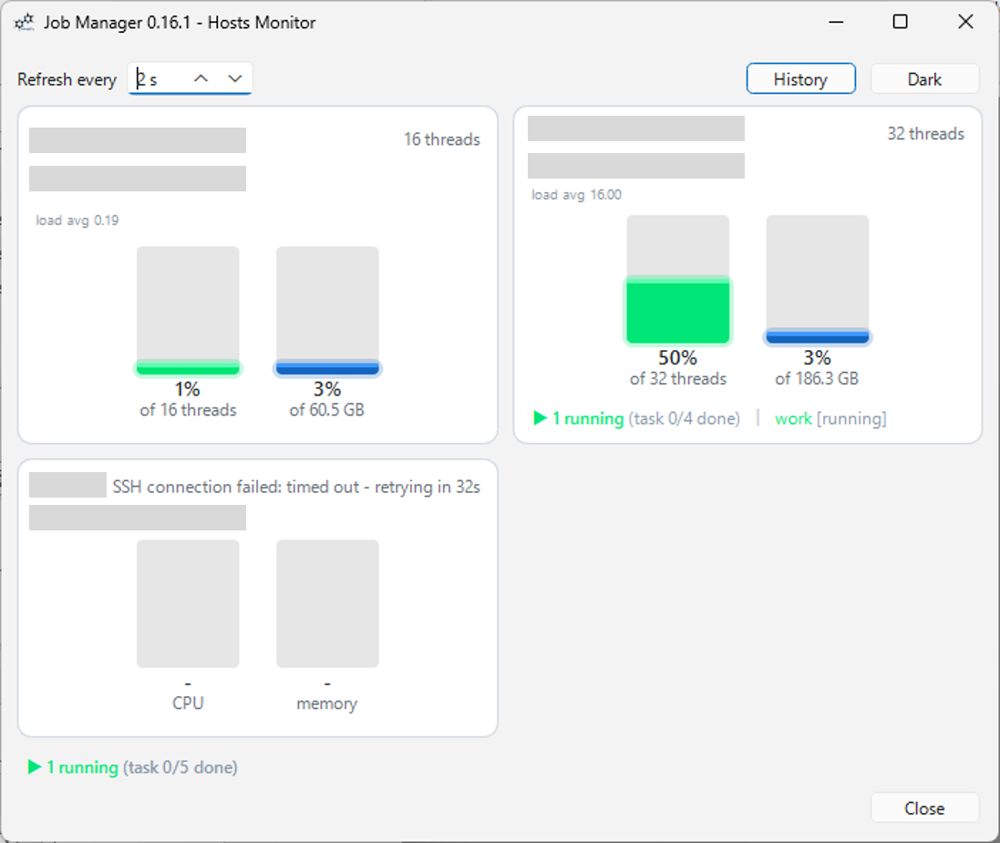

# Job Manager

[](https://github.com/HiroYokoyama/moleditpy_job_manager/actions/workflows/tests.yml)

[](https://github.com/HiroYokoyama/moleditpy_job_manager/tags)
[](https://github.com/HiroYokoyama/moleditpy_job_manager/releases)
[](LICENSE)

Repo: [https://github.com/HiroYokoyama/moleditpy_job_manager/](https://github.com/HiroYokoyama/moleditpy_job_manager/)

A [MoleditPy](https://github.com/HiroYokoyama/python_molecular_editor) plugin that
runs your calculations on a remote cluster without leaving the editor.

MoleditPy can already *write* QM inputs (ORCA / Gaussian / VASP / QE / CP2K Input
Generator Pro) and *read* the results (ORCA Result Analyzer, Gaussian MO & Freq
Analyzers, Cube Viewer). Job Manager fills in the middle: upload, submit, watch,
fetch, open.




## What it does

- **Submit** an input file to SLURM, PBS/Torque, SGE/UGE — or to a plain
  background process on a machine with no queue at all, including **this
  machine**, with no SSH involved.
- **Submit work that is already there.** Point a job at a directory on the
  host instead of uploading anything: `~/runs/mol42` and a command is a whole
  job. Input files are optional throughout — name one that is already in that
  directory and `{input}` still works, or run a command that needs none. The
  directory is *checked*, never created, and everything the wrapper writes
  there carries the job id, so several jobs can share one prepared directory
  without overwriting each other's results.
- **Run natively on Windows**, with nothing to install: choose the Windows
  scheduler and the wrapper, the status checks and the plugin's own commands
  are all PowerShell, which ships with the OS — including the helper queue,
  which has a PowerShell runner of its own. It works the same way over SSH to
  a Windows machine: commands are sent as encoded PowerShell, so the server's
  default SSH shell may be either `cmd` or PowerShell.
- **Run inside WSL** from Windows, which is where most calculation programs
  are actually installed. The job directory, the wrapper and the outputs are
  all Linux side — the same bash script a cluster is sent — and input files
  are translated and copied across for you (`wslpath`, so a distribution that
  mounts its drives somewhere unusual still works).
- **Chain** jobs — "run this after that one" — using each scheduler's own
  mechanism (`--dependency=afterok`, `-W depend`, `-hold_jid`), or a wrapper
  that waits for the previous process where there is no queue at all. Ask for
  `afterany` instead when the jobs are independent, and see a job marked
  **BLOCKED** — rather than a permanent, misleading PENDING — for every job
  stranded by a failure under a dependency the queue can never satisfy, not
  just the one directly behind it.
- **Schedule what a workstation can actually run** — the piece `nohup` has no
  scheduler for. A small helper queue on the host dispatches by **physical
  cores and memory**, not by a job count: eight single-core jobs run together
  on an eight-core box, two 90 GB jobs never share 120 GB, and the rest wait.
  It needs nothing installed, holds the queue in plain numbered shell scripts
  you can read over `ssh`, keeps moving with MoleditPy closed, and exits by
  itself the moment the queue is empty. (A dependency-chained mode is there
  too, for hosts where nothing at all may be left behind.)
- **Schedule** a start time (`--begin`, `-a`, or a sleep). The job is handed
  over now; MoleditPy need not be running when it starts.
- **Rebuild a job list from a folder** of results nobody tracked: fetched by
  hand, copied off a cluster, or run before this plugin existed. One record
  per directory that holds outputs, saved beside them as a `.pmejbs` and
  marked read only — results can be opened from it, but nothing in it can be
  submitted, cancelled or polled, because there is no host behind any of it.
- **Track** every job in one table: queue id, state, elapsed time, and what it
  is queued behind. A double click opens the log while a job runs and the
  result once it has finished. Status survives closing the window, closing the project,
  and restarting MoleditPy — tracking resumes by itself at launch when jobs
  from a previous session are still running.
- **Watch** without the window open: a counter appears in MoleditPy's own
  status bar while anything is running, queued or blocked, and opens the
  monitor when clicked. Nothing is shown, and nothing is polled, when there are
  no jobs. Optionally the same count goes on the application icon in the **OS
  task bar** — the Dock on macOS, the task bar button on Windows, the launcher
  entry on Linux — which is off by default, since the icon is MoleditPy's
  rather than this plugin's.
- **Be told** when a job ends: a desktop notification names the job and the
  host when it finishes, fails or vanishes from the queue. On by default, and
  one checkbox away from off.
- **Read the request from the input** rather than asking for it twice: ORCA,
  Gaussian, Psi4, NWChem, Q-Chem and GAMESS all state their own memory and
  cores, so the wizard fills those fields in — ORCA's `%maxcore` is *per core*
  and is multiplied out, which is the difference between a 3 GB job and a
  24 GB one. Anything you have already typed is left alone.
- **Hold** the queue on a host without cancelling anything, change its limits
  while jobs are already waiting, and **Detect** what the machine really has.
- **Drop** an input file on the Job Monitor to start: the wizard opens
  prefilled, named after the file, with its command template chosen.
- **Fetch** the outputs automatically when a job ends — next to the input file
  by default, so results sit where you are already working — then hand them to
  whichever plugin already claims that file type — a finished ORCA run opens in
  the ORCA Result Analyzer with no extra configuration.
- **Tail Remote Logs & Outputs with Tree Picker** — choose any remote file across
  the calculation directory via an interactive tree browser with instant filtering,
  featuring auto-refresh (5s for Paramiko/Local, 10s for OpenSSH) enabled by default.
- **Host Monitor Dashboard** — live visual load/memory gauges, CPU sparklines, running
  job names and overall progress indicators (`task X/Y done`) with persistent preferences.
- **Resubmit** a job with one click: same host, same inputs, same resources.
- **Save** the list as a `.pmejbs` file or **export** it as CSV, **clear** it (the old list
  is archived, never deleted), and **reopen** any saved list — from the button,
  from File ▸ Import, or by dropping it on the window.


### Submitting straight from an input generator

ORCA Input Generator Pro and Gaussian Input Generator Pro show a
**Submit to Cluster...** button beside Save when this plugin is installed. It
saves the input and hands it here, prefilled -- no file picker, no retyping the
job name. Without this plugin the button is not shown at all.

Other plugins can do the same by calling `job_manager.submit_file(paths,
name="")`, found through the host's plugin list. It is a public API: the name
and signature will not change without a major version.

### What it does not do

**No workflow graph.** Chaining is a straight line: each job waits for one
predecessor. There is no fan-out, no "run C after both A and B", and no retry
on failure. For anything branching, write the dependencies by hand in *Extra
directives* — Job Manager passes them through and tracks the jobs normally.

## Documentation

| Document | Covers |
|---|---|
| [docs/WORKFLOW.md](docs/WORKFLOW.md) | the standard path end to end, command templates, reading job states, troubleshooting |
| [docs/ARCHITECTURE.md](docs/ARCHITECTURE.md) | layers, threading, polling, the sentinel, persistence, the `submit_file()` handoff |
| [docs/RUNNER.md](docs/RUNNER.md) | the queue that runs on a machine with no scheduler: layout, safety rules, core and memory budgets |
| [docs/SECURITY_MODEL.md](docs/SECURITY_MODEL.md) | what is stored and where, how keys and passwords are handled, host-key policy, trust boundaries |

## Requirements

- MoleditPy 4.x (or Python 3.9+ with PyQt6 for standalone mode)
- An SSH client. `ssh` and `scp` ship with Windows 10+, macOS and Linux, and the
  default backend uses them directly — **no pip packages required**.
- Optional: `pip install paramiko`, only if a host needs password authentication.

## Standalone Mode

Job Manager can be launched directly as a standalone desktop application without running MoleditPy:

```bash
# Run as a module from your Python environment / plugins path:
python -m job_manager

# Or run directly inside the plugin folder:
python __main__.py
```

### Launch via Batch File (.bat) & Desktop Shortcut

If you want to launch Job Manager with a single double-click from your desktop, create a `.bat` file (e.g. `launch_job_manager.bat`):

```bat
@echo off
start "" pythonw -m job_manager
```

*(Tip: Using `pythonw` launches the GUI cleanly without a persistent black console window).*

**To create a Desktop Shortcut:**
1. Save the command above into `launch_job_manager.bat`.
2. Right-click the `.bat` file and choose **Send to ➔ Desktop (create shortcut)**.
3. *(Optional)* Right-click the new shortcut ➔ **Properties** ➔ **Change Icon...** to assign a custom icon.


## Four backends


| | OpenSSH (default) | paramiko (optional) | This machine | WSL |
|---|---|---|---|---|
| Install | nothing | `pip install paramiko` | nothing (needs bash, or the Windows scheduler) | nothing (needs a WSL distribution with bash) |
| Auth | keys and ssh-agent | keys, agent **and passwords** | none needed | none needed |
| `~/.ssh/config` | inherited automatically | `HostName`, `User`, `Port`, `IdentityFile` | not applicable | not applicable |
| `ProxyJump` | yes | refused, with an explanation | not applicable | not applicable |
| Connection | one process per command (multiplexed on macOS/Linux) | one persistent session | no network at all | no network at all |
| Job chaining | via the queue's own flag | via the queue's own flag | the wrapper waits for the process | the wrapper waits for the process |

The OpenSSH backend runs `ssh` in batch mode on purpose: a background thread must
never block on an invisible password prompt — and it also means **no password can
reach the process table**. If a host only accepts passwords, switch it to the
paramiko backend and tick *Ask for a password when connecting*.

**Passwords are never written to disk.** They are held in memory for the session,
asked for again after a restart, and forgotten when you delete the host. Unknown
host keys are rejected, not silently trusted — you are shown the fingerprint and
asked.

For exactly what is stored where, see [docs/SECURITY_MODEL.md](docs/SECURITY_MODEL.md).

## Polling is deliberately slow

A login node is not a status API, so:

- one `squeue`/`qstat` per **host** per cycle, no matter how many jobs you have;
- 120 s by default. You *can* go faster — down to 5 s, which is useful against
  your own workstation or while debugging — but anything under 30 s is flagged
  with a **⚠ fast** warning next to the field explaining what it costs the login
  node;
- the timer stops entirely when no job is active;
- a host that errors backs off exponentially, up to 15 minutes;
- **Refresh Now** is there when you actually need an answer immediately.

## How completion is detected

Every generated script installs these traps before running your command:

```bash
trap '__moleditpy_rc=$?; echo "$__moleditpy_rc" > .moleditpy_rc.tmp && mv -f .moleditpy_rc.tmp .moleditpy_rc' EXIT
trap 'exit 143' TERM
trap 'exit 130' INT
trap 'exit 129' HUP
```

When a job disappears from the queue, the plugin reads that one file: an exit
code means finished (0 → DONE, anything else → FAILED with the code shown);
no file means the job was killed before the command returned (→ LOST). This works
identically on all four schedulers and needs neither `sacct` (often disabled) nor
site-specific `qstat -f` parsing.

An `EXIT` trap rather than a trailing `echo`, because a payload that calls `exit`
itself would never reach a trailing line. The signal traps matter just as much:
without them a job the scheduler *kills* — walltime, preemption, `scancel`, node
drain — reaches the `EXIT` trap with `$?` still 0 and is recorded as a clean
success. `FAILED (rc=143)` is what a walltime kill looks like now.

## Usage

1. **Extensions ▸ Job Manager ▸ Job Monitor**, then **Hosts…** to add a cluster:
   hostname, user, scheduler, and a remote working directory. Press
   **Test Connection**.
2. **New Job…** — pick the host, add your input file, fill in walltime / nodes /
   memory / modules, and choose the command from the **Template…** dropdown,
   check the **Script preview** tab, and submit. Save the settings as a named
   preset to reuse them.
3. Watch the table. When the job finishes its results are downloaded and the main
   output is opened for you.

Step 2 needs no input file if the work is already on the host: tick **Work
already on the host**, give the directory, and **Check** it before you submit.
See [Work that is already on the host](docs/WORKFLOW.md#work-that-is-already-on-the-host).

### Command templates

The dropdown beside the Command field carries a conventional invocation for every
program MoleditPy writes input for — ORCA, Gaussian, CP2K, GAMESS, MOPAC, NWChem,
Psi4, PySCF, Quantum ESPRESSO, VASP and xTB — with the caveats that matter
(ORCA needs its own absolute path to start MPI workers; `g16` writes its own
`.log`; VASP takes no input filename at all). The list puts the likely program
first for the input you selected, and never overwrites a command you have
already written.

Type your own and **Template… ▸ Save current command as…** keeps it in
`settings.json` alongside your hosts and presets.

Placeholders come in two spellings — `{input}` or `[input]`, whichever fights
your shell less:

`input`, `stem`, `basename`, `output` (`<stem>.out`), `nodes`, `ntasks`, `cpus`,
`memory`, `walltime`, `queue`.

Unknown tags are left verbatim, and shell syntax that merely looks like one —
`awk '{print $1}'`, `if [ -f x ]` — is passed through untouched.

## Standalone Mode

The Job Manager and Host Monitor can be launched directly without running MoleditPy:

- **Job Manager**: `launch_job_manager.bat` or `python -m job_manager`
- **Host Monitor**: `launch_host_monitor.bat` or `python -m job_manager --host-monitor`

On Windows, create a shortcut to either `.bat` file for one-click desktop access in the background.

## Where your data lives

`~/.moleditpy/job_manager/`

- `settings.json` — host profiles, submit presets, preferences, saved command
  templates. **No secret is ever written here**: a host profile has no password
  field, and a key is referenced by path, never copied
- `jobs.pmejbs` — the tracked jobs. `.pmejbs` is MoleditPy's extension for a job
  list, the same idea as `.pmeprj` for a project; the contents are plain JSON
- `archived/jobs_<date>.pmejbs` — lists written out by **Clear List**. Clearing
  never deletes: delete these yourself when you want them gone
- `downloads/` — fetched results, one directory per job

A job list carries an `archived` flag inside the file. An archived list opens
read-only; any other one — an export, a backup, a file from a colleague — can be
opened as the list you are working in for that session.

Deliberately **outside** the plugin folder: the Plugin Installer replaces that
folder wholesale on update, so anything stored there would be lost. Jobs run for
days; the record of them has to outlive an update.

## Development

```bash
python -m pytest tests/ -v --cov=job_manager --cov-report=term-missing
```

The suite is fully offline — a fake transport records the commands that would
have been sent, so submit → poll → complete → download is exercised end to end
without a cluster. GUI tests need PyQt6 and skip themselves without it, which is
what lets the whole suite run on a bare `pip install pytest`.

Three tiers skip themselves unless their prerequisites are present:

| Tier | Needs |
|---|---|
| GUI (`test_dialogs`, `test_poller`, `test_service`, `test_plugin_entry`) | `PyQt6` |
| Script execution (`test_script_execution`) | a `bash` on `PATH` |
| Real `PluginContext` (`TestWithRealPluginContext`) | a `python_molecular_editor` checkout **and** `PyQt6` + `rdkit` — importing the main app pulls in both |

CI runs all three; the integration job fails deliberately if the real-context
tier skips, since a silently skipped tier is indistinguishable from a passing
one in the log.

## License

Licensed under the GNU General Public License v3.0 — see [LICENSE](LICENSE) for details.
